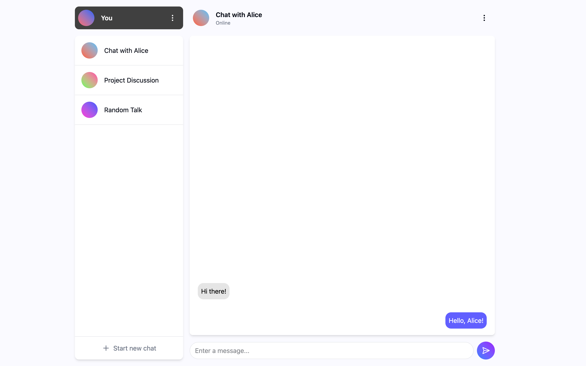
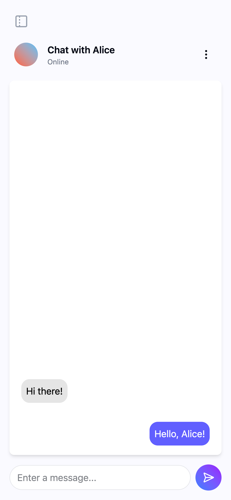

# Chat App

A modern, responsive chat application built with React, TypeScript and Vite.

## About

A chat interface featuring a clean, intuitive design with support for multiple conversations. The application adapts seamlessly between desktop and mobile layouts.

| Desktop | Mobile |
|---------|--------|
|  |  |

## Tech Stack

- **React 19** - UI framework
- **TypeScript** - Type safety
- **Vite** - Build tool and dev server
- **Tailwind CSS 4** - Styling
- **Zustand** - State management
- **Radix UI** - Accessible UI primitives
- **Lucide React** - Icons

## Getting Started

### Prerequisites

- Node.js (v18 or higher recommended)
- npm, yarn, or pnpm

### Installation

1. Clone the repository:
   ```bash
   git clone <repository-url>
   cd chat-app
   ```

2. Install dependencies:
   ```bash
   npm install
   ```

### Running Locally

Start the development server:
```bash
npm run dev
```

The app will be available at `http://localhost:5173`.

### Other Commands

| Command | Description |
|---------|-------------|
| `npm run build` | Build for production |
| `npm run preview` | Preview production build |
| `npm run lint` | Run ESLint |

## TODO

- [ ] Front-end
  - [ ] Sidebar
    - [x] Profile info
    - [x] Chat history
    - [x] "Start new chat" button
  - [ ] Chat View
    - [ ] Chat info
    - [ ] Chat message history
      - [ ] Display messages
    - [x] Message form
  - [ ] Login/Sign-up
  - [ ] Settings
- [ ] Back-end